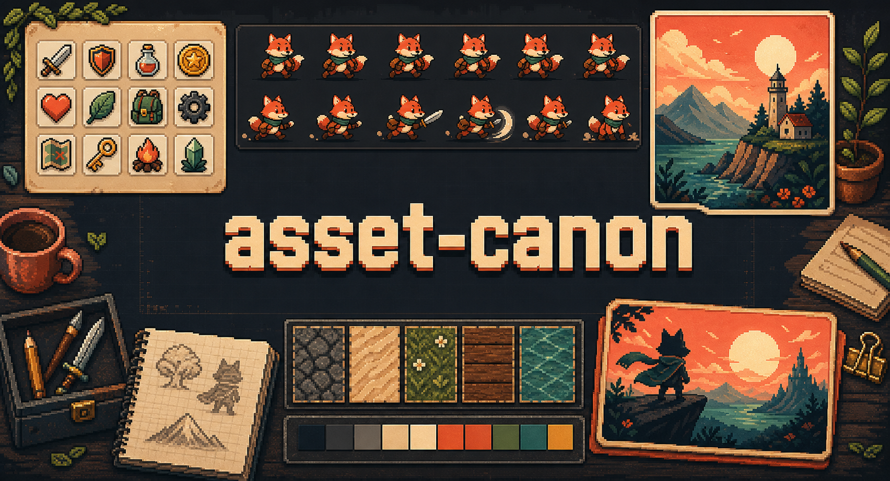

# Asset-Canon

Codex-powered **image asset generation** skills + commands for AI coding agents (Claude Code, Codex, Cursor).

Turn a one-line brief into production-ready image files on disk — icons, illustrations, sprites, textures, and social/OG images — with a deterministic pipeline: **brief → plan → generate (Codex) → optimize → write → report.**



## What it can do

- Route a plain-language brief to the right specialist: icon, illustration, sprite, texture, or social.
- Keep a batch visually consistent with a shared style profile, palette, and prompt suffix.
- Write production-ready assets to disk with deterministic names and framework-aware output paths.
- Emit sidecar YAML descriptors so another agent can place an asset without opening the image.
- Re-run future generations from the saved style profile instead of re-guessing the look.

## Install

### Via `npx skills add` (Vercel Agent Skills)

```bash
# all skills
npx skills add github:dodoxtech/asset-canon

# a single skill
npx skills add github:dodoxtech/asset-canon/skills/asset-icon
```

Each specialist is **self-contained** — installed alone it still detects your framework's output folder, keys backgrounds, and runs the final verify gate. Adding `asset-canon` on top gives you one-prompt **routing across asset types** and a **shared style profile** that keeps a whole batch consistent.

### Via Claude Code plugin marketplace

```bash
/plugin marketplace add dodoxtech/asset-canon
/plugin install asset-canon
```

This installs both the **skills** and the **slash commands**.

## How to use

You don't run scripts. After installing, you just **ask your coding agent in plain language** — the skill does the rest.

```text
You: "Generate a flat line icon set — cart, search, user — for my store."
```

The agent recognizes the request, loads the `asset-canon` skill, and runs a fixed pipeline:

```
BRIEF  →  PLAN  →  GENERATE  →  OPTIMIZE  →  WRITE  →  VERIFY  →  REPORT
```

| Step | What the agent does |
|---|---|
| **BRIEF** | Reads your request (or you run `/asset-new` to scaffold one). |
| **PLAN** | Picks the right specialist (icon / illustration / sprite / texture / social), locks **one** palette + style (written to `docs/assets/styles/style-profile-<slug>.yaml`), updates `docs/assets/styles/active.yaml`, and **detects your framework** to choose where assets go (Next.js → `public/assets/`, fallback → `assets/`). |
| **GENERATE** | Calls an **image model** (Codex CLI or OpenAI `gpt-image-1`) to render the pixels. Never draws art in code. Renders on a chroma-green plate when a transparent background is needed. |
| **OPTIMIZE** | Keys out the background to real alpha (tolerance-based, then re-checked for residue), downscales to a size ladder, exports webp/png/ico, packs sprite sheets, strips metadata. |
| **WRITE** | Saves the image files in your framework's static folder (e.g. `public/assets/icons/`) with deterministic names (`cart-icon-line-512x512.png`), a descriptor in `docs/assets/`, and a per-asset style snapshot in `docs/assets/styles/`. |
| **VERIFY** | Re-checks every output file against the standard — naming, real dimensions, fully-cut background (no plate residue), in-budget palette, sidecars present — and stamps `✓ PASS` / `✗ FAIL` per asset. Fails get fixed before reporting. |
| **REPORT** | Tells you exactly which files it created, where, and the pass verdict. |

### Minimal flow

1. **Install** (above).
2. **Ask** the agent for assets — or run `/asset-gen` with a brief.
3. The agent generates, optimizes, and **writes real files to disk** in your project.
4. Done. Re-run anytime; the active shared style profile (`docs/assets/styles/active.yaml` -> `style-profile-<slug>.yaml`) keeps new assets consistent with old ones.

> You need an **image model** reachable: either the Codex CLI, or set `OPENAI_API_KEY`. Without one, the skill stops and tells you — it will never fake an asset by drawing it in code. See [Requirements](#requirements).

### Example prompts

```text
Generate a flat line icon set for my store: cart, search, profile.
```

```text
Create a cohesive asset pack for a cozy fantasy game: player sprite, terrain textures, and an OG card.
```

```text
Match this reference image style and generate three marketing illustrations for a docs site.
```

## Files the skill reads & writes

These appear **in your own project** as you generate. You rarely edit them by hand — the skill manages them — but here's what each is for:

| File / folder | Role | Who writes it |
|---|---|---|
| `docs/assets/styles/active.yaml` | **Active-style pointer.** A one-line `active: style-profile-<slug>.yaml` naming which shared profile is currently in force. Readers resolve the shared look through this file first. | Skill (PLAN / RESTYLE / style-extract) — commit it |
| `docs/assets/styles/style-profile-<slug>.yaml` | **The shared look (project source).** One palette, line weight, shading, `prompt_suffix`, anti-slop `negative` list, and `seed`. Every generation reads it so a whole project stays visually consistent. Written once, reused forever. | Skill (on first PLAN) — commit it |
| `<static-dir>/assets/<type>/<slug>-<variant>-<WxH>.<ext>` | **The actual asset files**, written to your framework's static folder — `public/assets/` (Next.js, Astro, Vite, CRA…), `static/assets/` (SvelteKit, Hugo…), `src/assets/` (Angular), or `assets/` if no framework is detected. Deterministic, lowercase-kebab names; transparent PNG where it matters, plus the webp/png/ico ladder. | Skill (GENERATE + OPTIMIZE) |
| `docs/assets/<slug>.yaml` | **Sidecar descriptor.** Machine-readable record of each asset's content, style, and intended placement — so another agent can place the asset correctly **without opening the image**. | Skill (WRITE) |
| `docs/assets/styles/style-profile-<slug>.yaml` | **Per-asset style snapshot.** The *resolved* style recipe that produced this one asset (shared profile + any per-asset overrides). Point a future generation at it to reproduce or make a faithful variant. | Skill (WRITE) |

> An asset isn't "done" until its image **and** both sidecars exist and it passes the final acceptance gate (naming, dimensions, clean background, in-budget palette).

## Skills

| Skill | Install name | Purpose |
|---|---|---|
| Orchestrator | `asset-canon` | Routes a brief to a specialist and runs the full pipeline |
| Icons | `asset-icon` | Favicons, app icons, UI glyph families |
| Illustrations | `asset-illustration` | Heroes, spots, empty states with one style system |
| Sprites | `asset-sprite` | Game sprites, tiles, spritesheets + atlas |
| Textures | `asset-texture` | Seamless tileable backgrounds & patterns |
| Social | `asset-social` | OG cards, thumbnails, banners at exact sizes |
| Style extract | `asset-style-extract` | Reverse-engineer a reusable style profile from an imported reference image |

## Commands

| Command | Does |
|---|---|
| `/asset-new` | Scaffold a brief and lock the style system |
| `/asset-gen` | Generate assets from a brief via Codex, then optimize + write |
| `/asset-variants` | Produce color / size / state variants of an existing asset |
| `/asset-optimize` | Resize ladder, webp/png/ico export, sprite packing, metadata strip |

## Requirements

- **Node.js ≥ 18** — runs every script.
- **An image model** — the [generate step](#pipeline-scripts) calls Codex CLI or the OpenAI image API (`OPENAI_API_KEY`). Assets are always rendered by a model, never drawn in code.
- **[`sharp`](https://sharp.pixelplumbing.com/)** — *optional*, for the pixel-processing steps. It's declared as an `optionalDependency`, so installing the skill does **not** pull it in automatically.

If `sharp` is missing, the skill should say so plainly and stop before background keying, resize/export ladders, or image QA. It can still deliver the raw generated source image, but it should not pretend the full post-process pipeline ran.

### Do I need `sharp`?

`sharp` does all the work that touches pixels: resizing, format export, composing a sprite sheet, and measuring real dimensions. Generation itself does not use it.

| Task | Needs `sharp`? |
|---|---|
| Generate images (Codex / OpenAI) | ❌ no |
| Write a descriptor / sprite atlas **data** | ❌ no (falls back to WxH in the filename) |
| Resize ladder + webp/png/ico export (`optimize-assets`) | ✅ yes |
| Compose the actual sprite **sheet PNG** (`pack-sprite`) | ✅ yes |
| Full image QA — alpha, color budget (`asset-qa`) | ✅ yes |

Every script **degrades gracefully** without `sharp` (prints a plan or emits data-only output) instead of crashing. To enable the pixel steps, install it in the directory the scripts run from:

```bash
npm install        # pulls sharp (downloads a native libvips binary for your OS)
```

End users who only generate images and emit atlas/descriptor data can skip it.

## Pipeline scripts

The skills are **instruction-first**: an agent runs the whole pipeline with its own tools, so a user who just installed the skill never has to fetch or run anything. These scripts are an **optional convenience** that automate the same steps when you're working inside this repo or in CI.

```bash
# define the shared style once, validate it, then every asset inherits it
node scripts/validate-style-profile.mjs --in docs/assets/styles/style-profile-<slug>.yaml

# reverse-engineer the measurable palette/color from a reference image, to paste
# into docs/assets/styles/style-profile-<slug>.yaml (the asset-style-extract skill; needs sharp)
node scripts/extract-palette.mjs --in docs/assets/refs/hero.png --colors 12

# generate one asset (Codex CLI backend, or OpenAI image API if OPENAI_API_KEY is set)
# --style-profile appends the shared style suffix + anti-slop guard + seed
node scripts/codex-imagegen.mjs --prompt "minimal line icon of a cart" \
  --size 1024x1024 --background transparent \
  --style-profile docs/assets/styles/style-profile-<slug>.yaml \
  --out assets/generated/icons/cart-icon-line-1024x1024.png

# optimize a folder into a size/format ladder (needs `npm install` for sharp)
node scripts/optimize-assets.mjs --in assets/generated/icons \
  --sizes 512,256,128 --formats webp,png --strip

# pack animation frames into a sheet + atlas (json / xml / texturepacker)
node scripts/pack-sprite.mjs --in assets/generated/sprites/hero_run \
  --name hero_run --columns 8 --fps 12 --formats json,xml,texturepacker

# write a sidecar descriptor so other agents can place the asset without opening it
node scripts/write-descriptor.mjs --spec cart.spec.json   # -> docs/assets/cart.yaml

# gate: every asset must have a valid descriptor (CI-friendly, exit 1 on failure)
node scripts/validate-descriptors.mjs --in assets/generated/icons
```

Every generated asset ships with a YAML descriptor in [`docs/assets/`](docs/assets/)
(content, style, intended placement, file variants) — see that folder's README.

### Backend selection
- **Codex CLI** (default): drives the `codex` executor to generate and save the file.
- **OpenAI image API**: set `OPENAI_API_KEY` to call `gpt-image-1` directly.

## Repo structure

```
asset-canon/
├── .claude-plugin/
│   ├── plugin.json          # Claude Code plugin manifest
│   └── marketplace.json     # marketplace entry
├── commands/                # slash commands
│   ├── asset-new.md
│   ├── asset-gen.md
│   ├── asset-variants.md
│   └── asset-optimize.md
├── skills/                  # SKILL.md files (one folder each)
│   ├── llms.txt             # index of skills
│   ├── asset-canon/SKILL.md # orchestrator
│   ├── asset-icon/SKILL.md
│   ├── asset-illustration/SKILL.md
│   ├── asset-sprite/SKILL.md
│   ├── asset-texture/SKILL.md
│   ├── asset-social/SKILL.md
│   └── asset-style-extract/SKILL.md  # reference image -> style profile
├── scripts/
│   ├── codex-imagegen.mjs      # generation executor
│   ├── optimize-assets.mjs     # post-process
│   ├── asset-qa.mjs            # image quality gate
│   ├── pack-sprite.mjs        # frames -> sheet + atlas (json/xml/texturepacker)
│   ├── write-descriptor.mjs   # emit docs/assets/<id>.yaml descriptor
│   ├── validate-descriptors.mjs # descriptor gate (every asset described)
│   └── validate-style-profile.mjs # gate the shared style profile
├── docs/
│   └── assets/              # one YAML descriptor per asset
│       └── styles/          # shared profiles + active pointer + per-asset snapshots
│           ├── active.yaml
│           ├── style-profile-<style-slug>.yaml
│           └── style-profile-<asset-slug>.yaml
├── assets/                  # generated output + brief templates
├── examples/                # sample outputs
├── skill.sh                 # local install-name -> path registry
├── package.json
├── CHANGELOG.md
└── LICENSE
```

## Star History

[](https://star-history.com/#dodoxtech/asset-canon&Date)

## License

MIT
